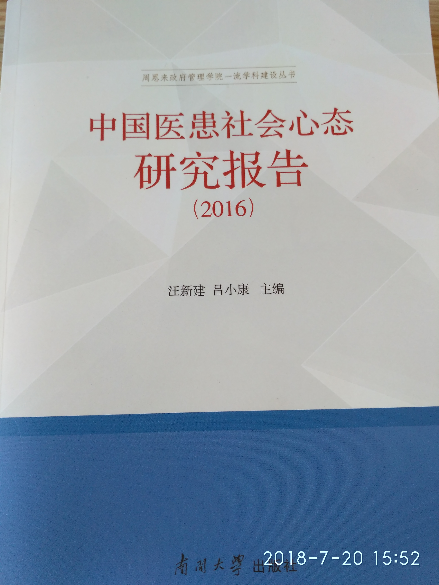
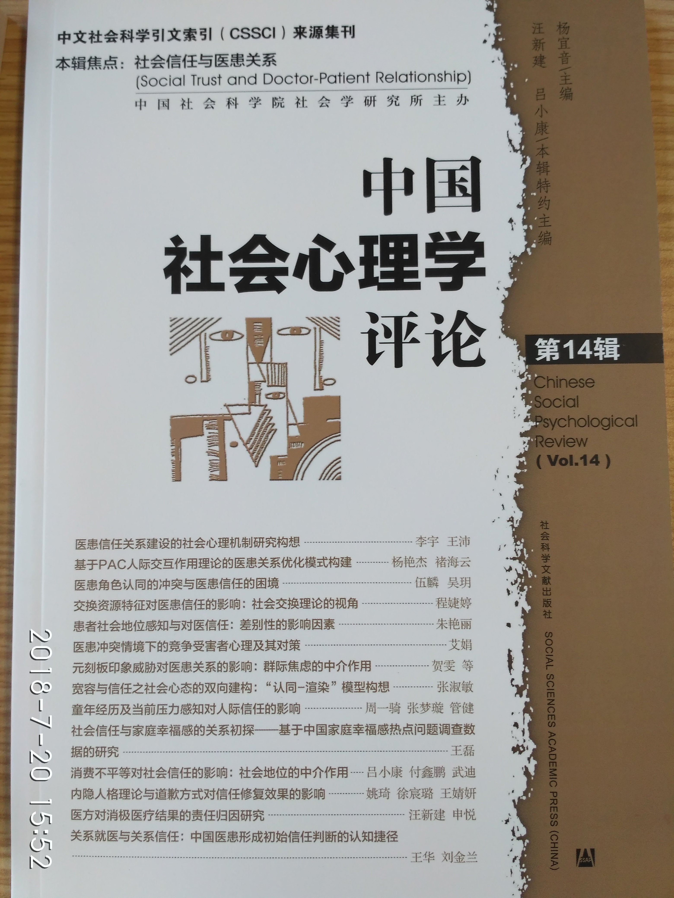
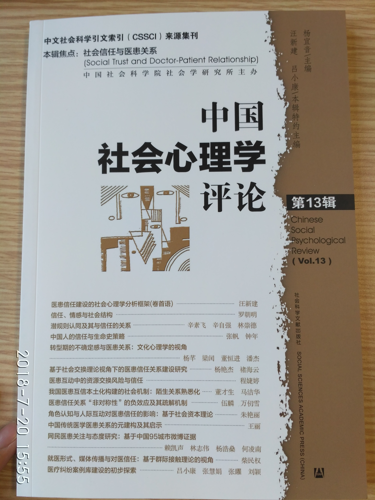

# “中国医患信任关系调查”项目简介

此目录暂为南开大学周恩来政府管理学院[汪新建](http://zfxy.nankai.edu.cn/wangxinjian)教授主持的教育部哲学社会科学重大攻关项目“医患信任关系建设的社会心理机制研究（15JZD030）”的官方信息发布目录。此目录名中的DPTrust即为Doctor-Patient Trust之意。当然，这里的医方与患方均采用广义界定。患方包括前往医疗机构求诊的患者及其亲属或代理人，医方包括在医疗机构工作的所有相关人员（医师、护士、药学技术人员、医技人员、管理人员和其他相关人员等符合[《医疗机构从业人员行为规范》](http://www.gov.cn/gzdt/2012-07/18/content_2186360.htm)所定义的医疗机构从业人员）。

## 课题基本信息

“中国医患信任关系调查”项目的全称是教育部哲学社会科学重大攻关项目“医患信任关系建设的社会心理机制研究（编号：15JZD030）”，课题首席专家为南开大学周恩来政府管理学院汪新建教授。课题另设6个子课题，由中国社会科学院社会学所、南京大学、吉林大学、哈尔滨医科大学、中央财经大学等科研机构与院校的专家承担。课题执行时间为2016年初至2018年底，在提交结题报告后仍将持续进行医患信任与医患关系的相关调查研究。

## 主要研究内容

课题从中国人信任关系建立的特征入手，探讨在当下社会背景、医疗体制和医学文化下建立医患信任的社会心理机制。课题拟联合社会学、医学、心理学和管理学等方面的研究力量，调查当下中国医患关系的现状与医患信任缺失的表现，并在此基础上根据中国人人际信任产生、维持与修复的社会心理机制，据此对建设和谐医患关系提出相应的社会心理学层面的对策建议。课题相关成果可为医疗机构优化就诊流程、改善患者的就医体验、提升医务工作者的工作满意度、缓解医患紧张关系提供数据支撑和案例佐证，同时也可为国家和地方相关管理部门提供相应的决策咨询参考。

## 资料收集方法

课题主要以问卷调查、个案访谈、参与观察、网络大数据采集与分析等形式进行资料搜集工作。目前，我们已与中国医学科学院血液学研究所血液病医院等医疗机构、北京市丰台区平合医患中心等相关机构建立长期合作关系，在相关临床科室展开全程的参与观察与资料收集工作。

目前课题正在开展“中国医患社会心态问卷”（分医方版和患方版）、“中国医患信任量表”（分医方版和患方）等多个测量工具，同时提供纸质版和在线版本，待正式施测将通过各种平台公开，供所有科研机构、医疗机构使用。同时，我们正在准备引进、翻译和校正有关普通人医学理念的国外量表，在提交信效度验证报告后再行公开。

## 研究成果

我们已根据中国知网（CNKI）的重要报纸期刊数据库整理了2000-2015年的，共包含16个字段、2625条案例的医疗纠纷案例库。该案例库还在进一步扩充之中。此外，我们还在中国社会科学院社会学所主编的[《中国社会心理学评论》](http://jikan.ssap.com.cn/collectedPapers_475.html)（CSSCI集刊）2017年第2期（2017年11月份出版）和2018年第1期（2018年5月出版）连续就医患信任主题进行组稿，发表多篇相关文章，是本课题成果的集中展现。目前，我们正在组织《中国社会心理学评论》2019年第2期的组稿工作。

另外，我们已完成《中国医患社会心态研究报告（2016）》的撰写工作，并于2018年5由南开大学出版社出版。此报告拟持续推出5年，形成系列报告，供科研人员和政府相关人士作为科研与决策参考。

### 部分成果展示

### 论文列表

部分文章可从此[链接](https://pan.baidu.com/s/1c2IhsBY#list/path=%2F)下载：

篇名 |	发表刊物
-----|------------
群体受害者身份感知对医务工作者集体内疚感的作用 |	西北师大学报，2016年1月
医患信任关系的特征、现状与研究展望	| 南京师大学报，2016年2月
医患社会心态建设的社会心理学视角	| 南京师大学报，2016年2月
医患信任危机发生机制探察——基于群际关系的视角	| 南京师大学报，2016年2月
心理治疗中的医患关系与身心修养	| 南京师大学报，2016年4月
人际医患信任的概念内涵、正向演变与影响因素	| 心理科学，2016年5月
空气污染对认知功能与心理健康的损害	| 心理科学进展，2017年1月
我国医患关系的人际—群际嬗变	| 南京师大学报，2017年2月
医患社会心态测量的路径、维度与指标	| 南京师大学报，2017年2月
媒体中的医方形象及其对医患信任的影响	| 南京师大学报，2017年2月
文化对个体风险感知的影响：文化认知理论的解释	| 心理科学进展，2017年8月
怨气：情感社会学的阐释	| 社会科学，2017年8月
医患信任建设的社会心理学分析框架 | 中国社会心理学评论， 2017年11月
医患互动中的资源交换风险与信任 | 中国社会心理学评论，2017年11月
角色认知与人际互动对医患信任的影响:基于社会资本理论 |中国社会心理学评论，2017年11月
就医形式、媒体传播与对医信任:基于群际接触理论的视角 | 中国社会心理学评论，2017年11月
医疗纠纷案例库建设的初步探索 | 中国社会心理学评论，2017年11月
网民医患关注与态度研究：基于中国95城市微博证据  | 中国社会心理学评论，2017年11月
医生角色的刻板印象及其在医患群体间的差异 | 南京师大学报，2018年1月
医患纠纷媒体报道框架及其对医患信任的影响 | 南京师大学报，2018年1月
交换资源特征对医患信任的影响:社会交换理论的视角 | 中国社会心理学评论， 2018年5月
患者社会地位感知与对医信任:差别性的影响因素 | 中国社会心理学评论，2018年5月
医方对消极医疗结果的责任归因研究 | 中国社会心理学评论， 2018年5月
医患观念差异与医患沟通现状调研	 | 中国医院院长，2018年8月
医者仁术:传统中国医学医患关系内涵探析 |	南开学报(哲学社会科学版)，2018年11月
医患“获得感悖论”及其破局——兼论作为社会心理学议题的医患关系研究 | 南京师大学报(社会科学版)，2019年1月
心理疾病的社会排斥及其对医患关系的影响 | 南京师大学报(社会科学版)，2019年1月
中国医患社会心态问卷的初步编制与信效度检验 | 心理学探新，2019年1月
主观社会阶层和负性情绪对医患信任的影响: 一个有调节的中介模型 |  西北师大学报(社会科学版)，2019年3月
互联网使用行为对医患信任的影响 | 西北师大学报(社会科学版)，2019年3月
常人疾病观及其对医患关系的影响 |	心理科学进展，2019年4月
中国医患信任量表的初步编制与信效度检验 | 投稿中
中国医患社会心态问卷分问卷的信效度检验 | 投稿中
风险社会语境下的医患信任：基于儿童血液病病房的参与观察研究  | 投稿中
反驳文本对患方信任和道德判断的影响与机制 | 《心理学报》，已接收
涉医新闻报道的媒体框架对医患信任的影响  | 投稿中
领悟社会支持对肺小结节患者焦虑抑郁状态的影响：医疗风险感知的中介作用 | 投稿中
医疗风险感知量表的编制与信效度检验 | 投稿中

## 合作方式与内容

医患关系与医患信任是一个动态演变的过程。为更加准确、全面地调查医患关系，我们需要相关医院机构、卫生管理部门、医疗相关中介机构等建立全面的合作关系，共同执行问卷调查与资料搜集的工作。我们可负责工具编制、数据采集、数据分析、报告撰写等工作，但需要获得相关的授权与进场研究许可。课题组可以南开大学周恩来政府管理学院的名义与相关单位签订资料采集、调查研究的委托协议，合作各方享有
